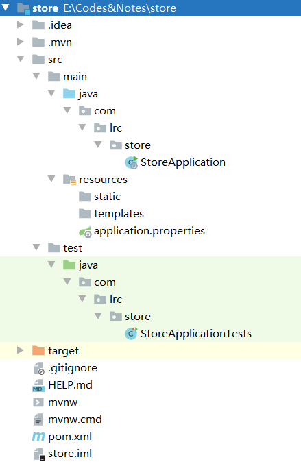

# 整体思路

## 系统和环境

操作系统：win10

JDK版本：1.8

项目管理工具：maven 3.0

IDE：IDEA 2020

数据库：MySQL 8.0

浏览器：Google Chrome

服务器架构：SSM、AJAX

本机地址IPV4：10.170.47.197

## 项目功能

登录、注册、用户管理（密码、个人信息、头像收货地址）、购物车（展示、增加、删除）、订单模块、热销产品

## 数据种类

用户、商品、商品类别、收藏、订单、购物车、收货地址

## 开发思路

- 持久层：根据前端的设置，规划和配置SQL语句
- 业务层：核心功能控制、业务操作和异常处理
- 控制层：接收请求、处理响应




# 搭建项目

1.项目名称：store	结构：com.lrc.store

新建`Spring Initializr`项目，构建一个基础的SpringBoot项目

2.导入基础jar包

```
javaweb
mybatis
mysqldriver
```

3.在properties中配置数据库连接源信息

```properties
spring.datasource.url=jdbc:mysql://localhost:3306/store?useUnicode=true&\characterEncoding=utf-8&serverTimezone=Asia/Shanghai
spring.datasource.username=root
spring.datasource.password=123456
```

4.创建数据库并测试连接

- （后端）在单元测试类中测试数据库连接是否可以正常加载，通过注入数据元信息，获取数据库连接对象的信息

```java
@Autowired
private DataSource dataSource;//注入数据元信息

@Test
void getConnection() throws SQLException {
    System.out.println(dataSource.getConnection());
}
//HikariProxyConnection@1290795133 wrapping com.mysql.cj.jdbc.ConnectionImpl@3238e2aa

//Hikari:数据库连接池，管理数据库的连接对象
```

- （前端）访问项目静态资源是否可以正常加载，resourses.static存储静态资源


> 注意:
> IDEA对于JS代码的兼容性较差，js代码可能无法正常加载。
>
> 解决：
> 1.idea缓存清理
> 2.clear-instal
> 3.rebuild重新构建
> 4.重启idea和操作系统

5.数据库操作

```sql
# 用户表
uid INT AUTO_INCREMENT COMMENT '用户id',
username VARCHAR(20) NOT NULL UNIQUE COMMENT '用户名',
PASSWORD CHAR(32) NOT NULL COMMENT '密码',
salt CHAR(36) COMMENT '盐值',
phone VARCHAR(20) COMMENT '电话号码',
email VARCHAR(30) COMMENT '电子邮箱',
gender INT COMMENT '性别:0-女，1-男',
avatar VARCHAR(50) COMMENT '头像',
is_delete INT COMMENT '是否删除：0-未删除，1-已删除',
created_user VARCHAR(20) COMMENT '日志-创建人',
created_time DATETIME COMMENT '日志-创建时间',
modified_user VARCHAR(20) COMMENT '日志-最后修改执行人',
modified_time DATETIME COMMENT '日志-最后修改时间',

# 地址表
aid INT AUTO_INCREMENT COMMENT '收货地址id',
uid INT COMMENT '归属的用户id',
NAME VARCHAR(20) COMMENT '收货人姓名',
province_name VARCHAR(15) COMMENT '省-名称',
province_code CHAR(6) COMMENT '省-行政代号',
city_name VARCHAR(15) COMMENT '市-名称',
city_code CHAR(6) COMMENT '市-行政代号',
area_name VARCHAR(15) COMMENT '区-名称',
area_code CHAR(6) COMMENT '区-行政代号',
zip CHAR(6) COMMENT '邮政编码',
address VARCHAR(50) COMMENT '详细地址',
phone VARCHAR(20) COMMENT '手机',
tel VARCHAR(20) COMMENT '固话',
tag VARCHAR(6) COMMENT '标签',
is_default INT COMMENT '是否默认：0-不默认，1-默认',
created_user VARCHAR(20) COMMENT '创建人',
created_time DATETIME COMMENT '创建时间',
modified_user VARCHAR(20) COMMENT '修改人',
modified_time DATETIME COMMENT '修改时间',
```

# 用户注册

当用户输入用户名和密码后，数据库将获取到的信息与表中信息进行比对，若不存在该用户，则注册成功，并跳转至登录页面。注册按钮的电机事件在**前端使用AJAX**实现。

- **创建实体类**

`BaseEntity`
实体类基类,由于用户和收货地址都有一些共同的属性（创建时间、创建者、修改时间、修改者）

`User`
用户实体类

## 1.持久层

基础sql语句：

```sql
# 注册需要插入数据
insert into t_user(除了uid以外的字段列表) values(匹配的值列表)

# 判断当前用户名是否已经存在
select * from t_user where username = ?
```

1.创建UserMapper接口，创建接口对应的映射文件，遵循和接口名称保持一致即可，创建`UserMapper.xml`。

2.将接口中的方法对应到SQL语句，用标签完成。

- namespace属性:用于指定当前的映射文件和哪个接口进行映射，需要指定接口的文件路径。

- 定义映射接口的方法，在标签内部设置sql语句

运行过程：insert等sql标签对应的语句通过映射的接口和UserMapper内部方法对应，从而做到一一对应。

3.将mapper文件注册到properties配置文件中

```properties
mybatis.mapper-locations=classpath:mapper/*.xml
```

告诉mybatis本地的映射文件在哪

## 2.业务层

1.规划异常。由于业务层异常都是在运行时才会出现，因此`ServiceException`继承自`RuntimeException`

根据业务层不同的功能来详细定义具体的异常类型，统一的去继承`ServiceException`。

- 用户名已存在异常
- 添加用户信息异常（服务器、数据库宕机）

2.创建Service类，作为用户模块业务层实现类。包括用户注册的业务层方法，通过UserMapper实现与MySQL连接

3.用户密码加密

**md5算法**：
(**盐值 + password + 盐值**)，通过md5算法进行加密，连续加载三次。
**盐值：随机的字符串**


## 3.控制层

1.**创建响应**

`JsonResult`将**状态码**、**状态描述信息**、**数据**封装在一个类中，该类的返回值传送给浏览器。

2.处理请求

```txt
请求路径：/users/reg
请求参数：User user
请求类型：POST
响应结果：JsonResult<Void>
```

`UserController`将请求和处理请求的处理器关联起来，建立映射关系。每个操作完成后需要有状态码和描述信息。将响应结果以json格式进行数据响应给前端。

在类的声明前加`@RestController`、`@RequestMapping("user")`。前者为控制层注解和响应体注解的结合，后者建立了请求和处理请求的控制器方法的映射关系

```java
@RestController = @Controller + @ResponseBody，
@ResponseBody//表示此方法响应结果以json格式进行数据相应给前端
```

3.`BaseController`创建一个控制层基类作为控制层父类，当控制层方法产生异常时，父类中的`@ExceptionHandler`注解保证可以及时拦截异常，并将返回值直接给到前端控制器。

## 4.前端页面

在register页面中编写**发送请求**的方法，点击事件来完成。选选中对应的按钮**($("选择器")**，再去添加点击的事件

在register.html页面添加script标签用于编写JS程序。通过AJAX监听注册按钮是否被点击，如果被点击则执行特定方法：执行post请求，通过读入表单数据获取json格式数据。判断并弹出对话框。

# 用户登录

当用户提交用户名和密码到后台数据库，如果数据库中信息存在表示登录成功。跳转至系统主页`index.html`。跳转在**前端使用jquery**完成。

## 1.持久层

1.基础SQL语句：

```sql
select * from t_user where username = ?
```

已开发

2.接口和方法

已开发

3.配置SQL映射

已开发

## 2.业务层

1.异常规划

- 用户不存在`UserNotFoundException`

**用户名不存在**或**isDelete==1**

- 密码错误`PasswordNotMatchException`

继承`ServiceException`，并生成五个构造方法

2.接口和抽象方法

`IUserService`接口添加`login`抽象方法。参数列表为用户名和密码，返回值为User，因为在用户登录后，页面右上角一般会有用户的个人信息的部分展示，这里将个人信息直接作为返回值课提高开发效率。

3.方法实现

通过`findByUsername()`查询用户数据。若结果为null或isDelete==1则抛出`UserNotFoundException`。

获取`salt`值，调用`getMD5Passord()`获取加密后密码，并判断密码是否一致。

创建`User`对象，存储部分个人信息（id、用户名、头像），并返回该对象。

> **注意**：这里新建的user将展示在前端右上角，作为个人信息。**调优**
>
> **层与层的数据传输体量变小，**
> **后台的层与层之间调用，数据量越小效率越高。**
> **前后端传递信息时，数据量体量越小，响应速度越快。**
> **(调优)**
> **相当于变相完成了数据的中转和压缩**

## 3.控制层

1.处理异常

业务层抛出的异常是什么，需要在统一的异常处理类中进行统一的捕获和处理。

`BaseController`

2.设计请求

请求路径：/users/login
请求方式：POST
请求结果：String username,String password
响应结果：JsonResult<User>

3.处理请求

将数据以json格式响应到前端

`UserController`

## 4.登录前端

在`login.html`页面依据请求来发送ajax请求

1.监听登录按钮的点击，`$("#btn-login").click(function(){})`

2.设置ajax参数

3.登录成功跳转至主页面，`location.href = "index.html"`

## 5.用户会话session

session对象主要存在服务器端，可以用于保存服务器临时数据的对象，所保存的数据可以在整个项目中都可以通过访问来获取，把session数据看作一个共享的数据，首次登录时所获取的用户数据，转移到session对象即可。

`session.getAttribute("key")` 可以将获取session中数据的行为进行封装，封装在`BaseController`类中

用户头像暂不考虑，后用cookie获取

在登录方法中将数据封装在session对象中，服务本身自动创建有全局的session对象。SpringBoot直接用HttpSession类型的对象作为请求处理方法的参数，会自动将全局的session对象注入到请求方法的session形参上。

## 6.拦截器

BUG描述：用户可以在没有登录的情况下，通过直接访问修改个人信息页面来进行操作。

- 拦截器，将前端的请求统一拦截到拦截器中，开发者可以在拦截器中定义过滤的规则。
- 如果不满足开发者设置的过滤规则，统一的处理是重新去打开login.html页面(重定向和转发)，推荐使用重定向。
- SpringBoot项目中拦截器的定义和使用，SpringBoot是依靠SpringMVC来完成的。SpringMVC提供了一个`HandlerInterceptor`接口，表示定义一个拦截器。

1.首先自定义一个类，在类中实现`HandlerInterceptor`接口。

```java
//HandlerInterceptor中三个方法：
//在调用所有处理请求方法之前被自动调用执行的方法
default boolean preHandle(HttpServletRequest request, HttpServletResponse response, Object handler) throws Exception { return true; }
//在ModelAndView对象返回之后被调用的方法
default void postHandle(HttpServletRequest request, HttpServletResponse response, Object handler, @Nullable ModelAndView modelAndView) throws Exception { }
//在整个请求所用关联的资源被执行完毕最后所执行的方法
default void afterCompletion(HttpServletRequest request, HttpServletResponse response, Object handler, @Nullable Exception ex) throws Exception { }
```

2.注册过滤器：添加黑名单和白名单

白名单（哪些页面可以在不登陆的情况下访问）：login\register\index\product

黑名单（在用户登录的状态下才可以访问的页面资源）：

3.注册过滤器：借助WebMvcConfigure接口，可以将用户定义的拦截器进行注册，才可以保证拦截器能够生效和使用。

定义一个类，然后让这个类实现WebMvcConfigure接口。配置信息，建议存放在项目的config包结构下。

`@Configuration`注解，用于加载当前拦截器并进行注册

# 修改密码

需要用户提交原始密码和新密码，再根据当前登录的用户进行信息的修改操作

## 1.持久层

1.规划SQL

修改用户password值

```sql
update t_user set password = ?, modified_user = ?, modified_time = ? where uid = ?
```

修改密码之前首先要判断当前用户信息是否存在

```sql
select * from t_user where uid = ?
```

2.接口和抽象方法

`UserMapper`接口，将方法抽象定义并映射到sql语句上

3.将方法配置到映射文件中

`userMapper.xml`

4.单元测试

`userMapperTest`

## 2.业务层

1.规划异常

```
1.用户的原密码错误，is_delete == 1、uid找不到
2.update过程中可能产生未知的异常，UpdateException
```

2.设计接口和抽象方法

`changePassword`

通过`uid`查询用户，`usename`作为修改人信息，`oldPw`、`newPw`分别代表原始密码和新密码

3.单元测试

`UserServiceTest`

## 3.控制层

1.处理异常

UpdateException需要配置在统一的异常处理方法中

`BaseController`

2.设计请求

`change_password`

此时

3.处理请求

在`UserController`中实现返回值为json格式的`changePassword`方法

## 4.前端页面

修改密码。在`password.html`页面依据请求来发送ajax请求

# 个人资料

个人资料页面包括三个表单：用户名、电话、邮箱，其中，用户名不能更改。当跳转到个人资料的页面时，需要更新当前的用户信息（输入电话，邮箱），另外，用户名通过查询获取。

**注意：这里的用户名也可以用session会话获取当前登录的用户的信息，但是不合适。因为session本身具有一定的周期，当用户长时间停留在某个页面而没有进行任何操作时，session 有可能失效，从而无法返回有效的用户信息**

## 1.持久层

1.SQL语句规划

```sql
# 根据表单信息更新用户的数据库信息
update t_user set phone = ?, email = ?, gender = ?, modified_user = ?, modified_time = ? where uid = ?

# 根据id查询用户信息
select * from t_user where uid = ?
```

其中，查询用户的方法不需要反复开发

2.接口和抽象方法

`UserMapper.java`中定义`updateInformation`方法

3.抽象方法映射

`UserMapper.xml`中编写映射

4.测试方法

## 2.业务层

> 功能规划
>
> - 当页面打开时，获取用户信息并填充到相应的文本框中
>
> - 监测用户是否点击了修改按钮

1.异常规划

（1）打开页面用可能找不到用户信息
（2）页面停留过程中有可能用户已经从数据库中被删除
		（点击按钮之前需要再次检测用户数据是否存在）

2.接口和抽象方法

`IUserService`中创建方法`getByUid`、`changeInformation`

3.重写两个抽象方法

## 3.控制层

1.设计请求

- 一打开页面，就发送当前用户的数据查询  GET

- 点击修改按钮发送用户的数据修改操作请求  POST

2.处理请求

`@RequestMapping("get_by_uid")`
`@RequestMapping("update_information")`

3.测试


## 4.前端页面

1.在打开userdata.html页面后自动发送AJAX请求，查询到的数据填充到这个页面("get_by_uid")

2.在检测到修改按钮被点击时发送一个AJAX请求("update_information")

# 上传头像

将对象文件保存在操作系统中，对应的路径以字符串形式记录在avatar中，即数据库保存图片的存储路径

## 1.持久层

1.sql语句

```sql
update t_user set avatar = ?, modified_user = ?, modified_time = ? where uid = ?
```

2.设计接口和抽象方法

`UserMapper.java`

3.接口映射

`UserMapper.xml`

4.测试

## 2.业务层

1.规划异常

- 用户数据不存在，
- 更新用户头像 未知异常

2.抽象方法

3.重写抽象方法

## 3.控制层

由于该异常出现在控制层，之前没有处理过控制层的异常，需要规划并处理异常

1.规划异常

- 父类

FileUploadException 泛指文件上传的异常，继承自RunTimeException

- 子类

FileEmptyException
FileSizeException
FileTypeException
FileUploadIOException

2.异常处理

在`BaseController`中更新状态码和异常信息

更新`@ExceptionHandler()`参数，在异常统一处理的参数列表上增加新的异常处理作为参数

`{ServiceException.class, FileUploadException.class}`

3.设计请求

对于传输数据，**GET请求提交数据在2KB左右**，不适合传输图片。应该使用POST。

设定文件大小限制和文件类型

4.`UserController`

> - 注解 @PostMapping
> - 判断异常
> - 设定上传的路径
> - 通过UUID获取新的文件名
> - 创建一个空文件并写入头像文件
> - 返回 Json 数据(状态码和文件路径)

## 4.前端页面

`upload`

直接通过表单进行文件的上传。在form标签中添加如下属性：

```xml
action = "/users/change_avatar"
method = "post"
enctype = "multipart/form-data"
```

另外，需要确保表单属性为`submit`


## 5.Bug及其解决

> 1.当上传图片大于1MB时，报错
>
> 2.图片选择完毕后没有在网页端显示
>
> 3.上传完毕后，再次登录不会显示头像

**1.修改限制**

SpringMVC默认可以上传的大小是1mb，可以通过两种方法更改可上传文件的大小

- 方法一：配置文件`application.properties`
- 方法二：通过Java设置文件的上传大小限制。在主类中`StoreApplication.java`进行配置，可以定义一个方法，使用`@Bean`修饰

**2.显示头像**

在页面中通过ajax请求来提交文件，提交完成后返回json串，解析出data的数据，设置到头像标签的src属性上。

`serialize()`：可以将表单数据自动拼接成`key value`形式提交给服务器。一般是提交普通控件类型的数据

`FormData`类：将表单的数据保持原有结构进行数据提交。

```js
new FormData($("#form")[0])
//文件类型的数据可以使用FormData对象进行存储
```

**3.登录后显示头像**

可以更新头像成功后，将服务器返回的头像路径保存在客户端cookie对象，然后每次检测到用户打开上传头像页面，在这个页面中通过ready()方法来自动检测去读取cookie中头像并设到src属性上。

# 新增收货地址

新建`t_address`表

创建收货地址实体类

## 1.持久层

1.规划sql语句

插入地址

```sql
insert into t_address values
```

一个用户的收货地址最多有20条数据对应。在插入数据之前先做查询操作。

```sql
select count(*) t_address where uid = ?
```

2.创建接口和抽象方法

`AddressMapper`接口

3.配置sql映射

`AddressMapper.xml`

4.单元测试

## 2.业务层

用户的第一条地址作为默认地址

1.规划异常

`AddressCountLimitException` 收货地址数量大于20 的异常

2.接口与抽象方法

创建一个`IAddressService`接口，并定义业务的抽象方法

`void addAddress(Integer uid, String username, Address address)`

3.定义实现类并重写方法

`AddressServiceImpl`

4.创建业务层测试类

`AddressServiceTest`

可改进：增加一个异常，检测每次添加收货地址是否已经存在

## 3.控制层

1.处理异常

`BaseController`

2.设计请求

POST请求

`AddressController`

3.测试

## 4.前端页面

检测到上传按钮被点击后发送AJAX请求。通过session获取对应的属性信息。同之前的ajax代码。

# 地址列表

获取省市区列表

数据库

```sql
id #id
parent #父区域地址号
CODE #本区域地址号
NAME #区域名
```

创建省市区实体类

`District`

## 1.持久层

1.规划sql语句

- 根据父代号查询所有子地址

升序排列，进行查询

```sql
SELECT * FROM t_dict_district WHERE parent = ? ORDER BY code ASC
```

2.设置接口和抽象方法

为方便解耦，提升代码的可复用性。创建一个`DistrictMapper`接口

定义`findByParent`方法，返回子地址的List集合

3.配置xml文件

`DistrictMapper.xml`

4.单元测试

## 2.业务层

业务层没有异常需要处理

1.创建接口`IDistrictService`，抽象方法

2.创建实现类`DistrictServiceImpl`

**注意：在进行网络数据的传输时，为了尽量避免无效数据的传递，可以将无效数据设置为null。一方面节省流量，另一方面提升效率**

3.单元测试

## 3.控制层

1.设计请求 GET

2.请求处理方法

`DistrictController`

将请求添加到白名单中

3.单元测试


## 4.前端页面

1.检查前端页面在提交省市区数据时是否有`name`、`id`属性

# 省市区

## 1.持久层

根据code获取当前省市区的名称

```sql
SELECT * FROM t_dict_district WHERE code = ?
```

抽象方法

配置xml

## 2.业务层

`AddressServiceImpl`

在address对象中添加 省市区 信息

## 3.前端页面

根据用户的选择来页次显示省市区信息

`addAddress.html`

1.设置省的select下拉列表，通过`ready()`函数，当加载页面时就可以

2.设置市区的下拉列表，通过`change()`函数，监听页面中省控件的变化情况

3.设置区的下拉列表，`change()`同上。

# 展示收货地址

## 1.持久层

1.数据库查询

```sql
SELECT * FROM t_address WHERE uid = ? ORDER BY is_default DESC, created_time DESC
```

2.接口和抽象方法

`AddressMapper`  `findByUid`

3.xml配置文件

4.单元测试

## 2.业务层

暂时不用抛出异常

1.业务层接口和抽象方法

`IAddressService`  `getByUid`

2.重写抽象方法

## 3.控制层

1.请求设计

2.编写请求

3.测试


## 4.前端页面

在`address.html`页面进行查询数据的展示

# 设置默认收货地址

## 1.持久层

1.SQL

```sql
# 检测当前地址的信息是否存在
SELECT * FROM t_address WHERE aid = ?
# 将所有收货地址设置为非默认
UPDATE t_address SET is_default = 0 WHERE uid = ?
# 将用户选中的记录设置为收货地址
update t_address SET is_default = 1, modified_user = ?, modified_time = ? WHERE aid = ?
```

2.接口中定义抽象方法

`AddressMapper`

3.配置sql在xml文件的映射

4.单元测试

## 2.业务层

1.异常规划

- UpdateException
- 非法访问：AccessDeniedException
- 地址不存在：AddressNotFoundException

2.抽象方法

3.实现抽象方法

4.单元测试

## 3.控制层

1.异常处理

在`BaseController`中统一处理异常

2.设计请求

3.编写请求

```java
//Restful风格的请求编写
@RequestMapping("{aid}/set_default")
```

4.测试

先登录再访问一个请求路径`localhost:8080/address/3/set_default`

## 4.前端页面

给默认收货地址添加一个onclick属性，在鼠标点击时发生，指向一个方法的调用，再这个方法中完成ajax请求

# 删除收货地址

## 1.持久层

1.sql语句

- 在删除之前判断该数据是否存在，是否属于当前用户。无需重复开发

- ```sql
  # 删除收货地址数据
  DELETE FROM t_address WHERE aid = ?
  ```

- 如果用户删除的是默认收货地址，将剩下的某一条设置为默认的收货地址

```sql
SELECT * FROM t_address WHERE uid = ? ORDER BY modified_time DESC LIMIT 0,1
```

- 如果用户只有一条收货地址数据，删除后的其他操作就不需要了

2.抽象方法

`AddressMapper`

3.在xml文件中映射sql语句

`AddressMapper.xml`

4.单元测试

## 2.业务层

1.异常规划

- `DeleteException` 删除时未知异常

2.抽象方法设计

`IAddressService`

3.实现抽象方法

4.单元测试

## 3.控制层

1.需要处理异常`DeleteException`类

2.设计请求

3.处理请求

## 4.前端页面

`address.html`

如前面两种方式

- `onclick`
- `click`

# 热销商品显示

1.编写sql语句，创建`t_product`表，并导入数据

2.创建实体类`Product`

注意：优先级属性指的是该商品卖出的个数，即，卖的越多越优先

## 1.持久层

1.规划sql，查询功能

```sql
SELECT * FROM t_product WHERE status = 1 ORDER BY priority DESC LIMIT 0,4
```

查询功能不需要异常

2.设置接口和抽象方法

`ProductMapper`

3.配置xml

## 2.业务层

1.抽象方法

`IProductService`

2.实现抽象方法

3.测试

## 3.控制层

1.设计请求

2.编写请求

`@RequestMapping("hot_list")`

## 4.前端页面

`index.html`


但是有个问题，点击任意一个商品都是跳转的同一个商品的页面，因为前端的设置是直接跳转到特定的html


# 展示商品详细内容

依据url中的id展示对应的商品详细内容

## 1.持久层

```sql
SELECT * FROM t_product WHERE id = #{id}
```

```java
Product findById(Integer id);
```

## 2.业务层

异常`ProductNotFoundException`

抽象方法定义并重写

## 3.控制层

```java
@GetMapping("{id}/details")
```

## 4.前端页面

`product.html`

# 加入购物车

## 1.持久层

```sql
# 查询订单是否已经存在于购物车
SELECT * FROM t_cart WHERE uid = ? AND pid = ?
# 若已经存在，则执行 加入购物车
INSERT INTO t_cart (除aid) values (值)
# 若未存在 则直接更新num数量
UPDATE t_cart SET num = ? WHERE cid = ?
```

## 2.业务层

异常规划

```java
//插入时异常
InsertException
//更新异常
UpdateException
```

均已设计

方法`addProductToCart`思路

查询购物车信息，并判断，分别对应新增商品和修改数量

## 3.控制层

没有需要处理的异常、设计请求、编写请求、单元测试

## 4.前端页面

监听“加入购物车”按钮，并发送ajax请求

# 购物车商品展示

预期效果


图片和商品来自t_product表，单价和数量来自t_cart表，金额由单价和数量计算得

## 持久层

数据来自两个表，**关联查询**

```sql
SELECT cid, uid, pid, 
	   t_cart.price, t_cart.num,
       t_product.title, t_product.image, 
       t_product.price AS realprice
FROM t_cart
LEFT JOIN t_product
ON t_cart.pid = t_product.id
WHERE uid = ?
ORDER BY t_cart.createdTime DESC
```

`CartMapper.java`、`CartMapper.xml`、单元测试

## 前端页面

P34

# 修改购物车商品数量

抽象方法`findByCid`

- ```sql
  SELECT * FROM t_cart WHERE cid = ?
  ```


- 更新t_cart表记录的num值	已有


- 更新异常(购物车数据未找到) `CartNotFoundException`


- `addNum()`、`subNum()`

- 通过监听前端增减按钮的点击情况，发送ajax请求。

# 显示勾选的购物车信息

用户在购物车列表通过勾选商品信息，点击结算后跳转到结算页面。该页面需要展示用户在上个页面对应的数据。

即，用户在前端传过来的勾选的商品信息用集合接收，并作为筛选条件，传递到数据库

```sql
SELECT cid, uid, pid, 
	   t_cart.price, t_cart.num,
       t_product.title, t_product.image, 
       t_product.price AS realprice
FROM t_cart
LEFT JOIN t_product
ON t_cart.pid = t_product.id
WHERE cid IN (..., ..., ...)
ORDER BY t_cart.createdTime DESC
```

- **MyBatis	接收集合中的内容**

  ```sql
  WHERE cid IN ( <foreach collection="array" item="cid" separator=",">#{cid}</foreach> )
  #指定类型为数组，参数为cid，分隔符为“,”
  ```

# 添加订单

创建实体类
`Order`订单信息
`OrderItem`订单商品信息

## 1.持久层

```sql
# SQL语句规划
INSERT INTO t_order(oid除外的所有字段) VALUES(字段值)
INSERT INTO t_order_item(id除外的所有字段) VALUES(字段值)
```

## 2.业务层

由于订单类存在地址信息，需要先获取到地址类的信息，也就是获取选择的收货地址的信息


## 3.控制层和前端

`orderConfirm.html`订单确认页面

# 性能和优化

检测项目中所有业务层方法的耗时，在不改变流程代码的前提下。

## 统计业务方法执行时长

1.AOP不是Spring内部封装技术，需要导包。

```xml
<dependency>
 <groupId>org.aspectj</groupId>
 <artifactId>aspectjweaver</artifactId>
</dependency>
<dependency>
 <groupId>org.aspectj</groupId>
 <artifactId>aspectjtools</artifactId>
</dependency>
```

2.定义一个切面类`TimeAspect`

3.切面方法，使用环绕通知

`ProceedingJoinPoint`接口表示目标方法的对象，即指向哪个方法。

4.将当前的环绕通知映射到指定切面。通过`Around`指定连接点，配置表达式。

# NEW

## Serializable

**序列化接口**，一个类只有实现了Serializable接口，它的对象才能被序列化。

- 序列化：序列化是将对象状态转换为可保持或传输的格式的过程。与序列化相对的是反序列化，它将流转换为对象。这两个过程结合起来，可以轻松地存储和传输数据。
- 把对象转换为字节序列的过程称为对象的**序列化**
  把字节序列恢复为对象的过程称为对象的**反序列化**

**应用场景：**

在定义**实体类**时，会选择继承Serializable接口。

当我们需要把对象的状态信息通过网络进行传输，或者需要将对象的状态信息持久化，需要把对象进行序列化。Serializable存储对象在存储介质中，以便在下次使用的时候，可以很快捷的重建一个副本。

**Serializable接口内部是空的，相当于一个标识接口。用于通知JVM将相应的类做序列化。**

- **serialversionUID**

serialVersionUID是用来辅助对象的序列化与反序列化的，原则上序列化后的数据当中的serialVersionUID与当前类当中的serialVersionUID一致，那么该对象才能被反序列化成功。这个serialVersionUID的详细的工作机制是：在序列化的时候系统将serialVersionUID写入到序列化的文件中去，当反序列化的时候系统会先去检测文件中的serialVersionUID是否跟当前的文件的serialVersionUID是否一致，如果一直则反序列化成功，否则就说明当前类跟序列化后的类发生了变化，

## @Data

`@Data`注解的主要作用是提高代码的简洁，使用这个注解可以省去代码中大量的`get()`、`set()`、`toString()`等方法

## DAO

用于持久层。负责与数据库联络的任务和方法都封装在此。

mapper层（即DAO层）：是对数据库进行数据持久化操作，他的方法语句是直接针对数据库操作的，用mybatis逆向工程生成。

设计思想：
首先设计DAO接口，然后定义此接口的实现类。通过Spring注解或配置文件实现DAO模块的调用，进行数据业务处理。

> DAO设计模式优点
> （1）DAO模式抽象出数据访问方式，业务逻辑层访问数据源时完全感觉不到数据源的存在。软件工厂中有一条很重要的法则：一个对象对其他对象的了解越少越好，了解越少就意味着依赖越少，可复用性越高。
>
> （2）DAO将数据访问集中在独立的一层，因为所有的数据访问都由DAO代理，这层独立的DAO将数据访问的实现和系统的其余部分剥离，将数据访问集中，使得系统更具可维护性。
>
> （3）DAO降低了业务逻辑层的复杂度。DAO管理复杂的数据访问，从而简化了业务逻辑层。所有与数据访问的实现有关的代码都不写在业务逻辑层里，业务逻辑层可集中处理业务逻辑，提高了代码的可读性和生产率。
>
> （4）DAO有助于提升系统的可移植性。DAO模式通过将数据访问划分为抽象层和实现层，分离数据使用和数据访问的实现细节。这意味着业务层与数据访问的底层细节无关，也就是说，可以在保持上层机构不变的情况下，通过切换底层实现来修改数据访问的具体机制，提高了系统的可复用性。

## JSON

JavaScript对象表示法（JavaScript Object Notation）

文本数据交换格式。

JSON 使用 JavaScript 语法来描述数据对象，但是 JSON 仍然独立于语言和平台。JSON 解析器和 JSON 库支持许多不同的编程语言。

> 数据格式
>
> - 格式：{ “key” : value}
> - 示例： {“key1”:100,“key2”:20}

## @RequestMapping

将请求和处理请求的控制器方法关联起来，建立映射关系。

SpringMVC接收到指定的请求，就会来找到在映射关系中对应的控制器方法来处理这个请求。

## @ExceptionHandler

异常拦截器，若类中产生异常，会被直接拦截到该注解修饰的方法中。

内部参数为数组，分别为对应的异常基类
@ExceptionHandler({..., ..., ...})

检测运行时异常，对应注解中的参数，即将运行异常和异常处理关联起来

## AJAX

`JQUery`封装了一个函数，称之为`$.ajax()`函数，通过对象调用ajax()函数，可**异步**加载相关请求。依靠JavaScript提供的XHR (XmlHttpResponse)，封装了此对象。

- ajax()使用方式。需要传递一个方法体作为方法参数来使用。

```js
$.ajax({
	url:"",
	type:"",
	data:"",
	dataType:"",
    success:function() {},
    error:function() {}
});
```

- ajax()函数参数含义

| 参数     | 功能请求                                                     |
| -------- | ------------------------------------------------------------ |
| url      | 标识请求的**地址**(url地址)，不能包含参数列表部分的内容。例如: url:"localhost:8080/users/reg" |
| type     | **请求类型**(GET和POST请求的类型)。例如: type: "POST"        |
| data     | 向指定的请求url地址提交的**数据**。例如: data: "username=tom&pwd=123" |
| dataType | 提交的**数据的类型**。数据的类型—般指定为json类型。dataType: "json" |
| success  | 当服务器**正常响应**客户端时，会自动调用success参数的方法，并且将服务器返回的数据以参数的形式传递给这个方法的参数上 |
| error    | 当服务器**未正常响应**客户端时，会自动调用error参数的方法，并且将服务器返回的数据以参数的形式传递给这个方法的参数上 |

## AJAX函数中data参数

- data: $("form表单选择").serialize()。当参数过多并且在同一个表单中，字符串的提交等

- data: new FormData($("form表单选择")[0])。只适用于提交文件

- data: "username = Tom"。适合参数值列表有限，可以手动拼接

  ```js
  let user = "Tom"
  data: "username = " + user
  ```

- ```js
  data: {
  		"username": "Tom"
  		"age": 18
  		"sex": 0
  }
  ```

  适合JSON格式提交数据

## 控制层和前端数据

SpringBoot控制层接收前端数据的方式（url地址或表单、json、路径传参）：

1.方式一：请求处理方法的参数列表设置为pojo类型来接收前端数据

SpringBoot会将前端的url地址中的响应参数名和pojo类的属性名进行比较，如果名称相同则将值注入到pojo类总对应的属性上。

2.方式二：请求处理方法的参数列表设置为非pojo类型

SpringBoot会将请求的参数名和方法的参数名直接进行比较，如果名称相同则自动完成值的依赖注入

## @Param & @PathVariable

MyBatis中特有注解

Param("SQL映射文件中#{}占位符的变量名")

当SQL语句的占位符和映射接口的方法参数名不一致时，需要将某个参数强行注入到占位符变量上时，可以使用@Param注解来标注映射关系

@PathVariable同样

## @RequestParam

SpringMVC特有注解

同上，解决前后端命名不一致问题

表示请求中的参数，将请求中的参数注入到请求处理方法的某个参数上，如果名称不一致可以使用该注解进行标记和映射

## MultipartFile

该接口是SpringMVC提供的接口，包装了**获取文件类型**的数据，可以接收**任何类型**的文件

SpringBoot整合了SpringMVC，只需要在处理请求的方法参数列表上声明一个参数类型为MultipartFile的参数，然后SpringBoot自动将传递给服务器的文件数据赋值给该参数

## Cookie

1.导入cookie.js文件

```html
<script src="../bootstrap3/js/jquery.cookie.js" type="text/javascript" charset="utf-8"></script>
```

2.调用cookie方法

```
$.cookie(key, value, time);//单位：天
```

## ResultMap 和 ResultType

- ResultType

将查询结果按照sql列名pojo属性名一致性映射到pojo中。


这里使用ResultType标签实现数据库中各个属性和pojo类中属性的一一对应。

- ResultMap

使用association和collection完成一对一和一对多高级映射（对结果有特殊的映射要求）


这里需要查询某个uid下有几个address信息，返回值为整型，使用select中的标签ResultType设定结果集类型为Integer

具体区别： 使用resultType无法将查询结果映射到pojo对象的pojo属性中。

所以对于数据库表单中的表头（属性）需要和pojo类中的属性对应。而代码中出现的不需要建立连接的值，用ResultType指定其结果集类型

## Spring读取配置文件的数据

`application.properties`配置文件

Spring读取配置文件的数据：

注解`@Value("${suer.address.max-count}")`

## Restful风格

Restful风格指的是网络应用中的资源定位和资源操作的风格。不是标准也不是协议。

https://blog.csdn.net/weixin_56032340/article/details/122587184

## VO

VO: value Object，值对象。

当进行SELECT查询时，查询的结果数据多张表中的内容，此时发现结果集不能直接便用某个POJO实体类来接收，POJO实体类不能包含多表查询出来的结果。解决方式是:重新去构建一个新的对象这个对象用户存储所查询出来的结果集对应的映射，所以把想这个的对象称之为值对象。

VO是组装类，映射结果集的组合

## AOP

面向切面编程。

如果我们想对业务的方法同时添加功能需求，并且在不改变原有的业务功能逻辑的基础上进行，可以使用AOP切面编程进行开发。

首先定义一个切面类，在类中定义**切面方法**(5类)，编写切面方法中的业务逻辑要执行的方法，通过连接点来连接目标方法(粗粒度、细粒度表达式)。

## 切面方法


- 切面方法修饰符必须是public
- 返回值是void或object，如果这个方法被`@Around`注解修饰，则必须返回object
- 切面方法的方法名称可以自定义
- 切面方法可以接收参数，参数是`@ProceedingJoinPoint`接口类型的方法。但是`@Around`所修饰的方法必须传递这个参数

# 出现的问题

## 修改密码显示原始密码错误

#### 描述

在通过url或通过页面进行修改密码时，显示原始密码错误

#### 原因

**方法参数列表中的非pojo类型数据需要和表单中的属性值保持一致**

由于控制层和前端页面直接通过注解`@RequestMapping("change_password")`实现连接，前端页面中表单所获取的输入值通过注解实现参数的前后端传递，而前端代码中的新密码和老密码必须与后端`changePassword`方法的新老密码名称保持一致。

数据在匹配时会匹配url中的参数名称（新老密码）


错误原因：
前端  oldPassword  newPassword
后端  oldPw              newPw


```

```

## 修改默认收货地址显示错误

#### 直接原因

```
Failed to convert value of type 'java.lang.String' to required type 'java.lang.Integer'
```

#### 过程

1.标记aid显示在前端页面


可见aid均为null

说明aid没有向其他属性一样正常传递，错误在java类中

#### 原因


这里之前为了数据传输的便利，将单个对象的信息量缩小，并把aid设置为null。修改即可。


